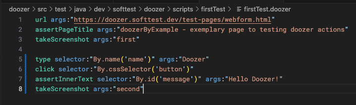
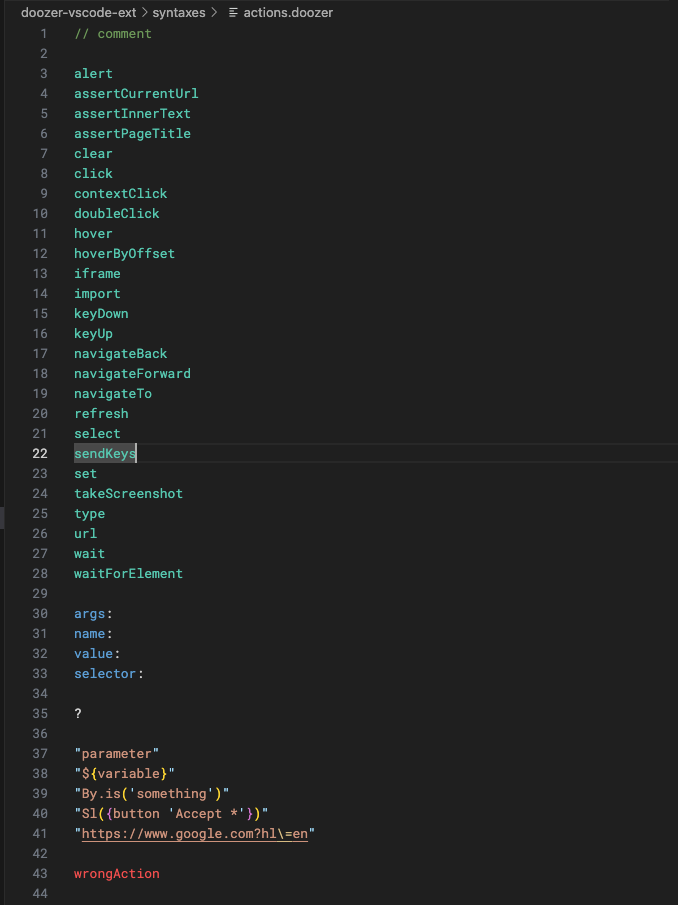

# doozer - VS Code Extension

Provides basic syntax highlighting for doozer script language. To learn more about **doozer** - *a
dead simple UI testing framework* - visit [https://doozer.softtest.dev](https://doozer.softtest.dev)

Exemplary doozer test case with syntax highlighting:

Doozer actions and parameters in supported syntax highlighting modes:

## Release Notes

### 0.2.1

- Update README

### 0.2.0

- Initial release

**Enjoy!**
